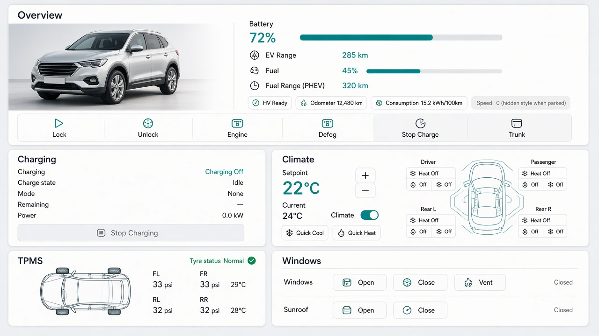

# CarLinko Cards — Objective

Home Assistant **dashboard cards** for vehicles managed by the [ha-carlinko](https://github.com/elad-bar/ha-carlinko/) integration.

This repository does **not** replace the integration. CarLinko entities and remote commands stay in `ha-carlinko`. This project ships Lovelace custom cards so users can build vehicle dashboards on top of that data.

Concept reference (same split of concerns):

- Integration: [jkaberg/hass-byd-vehicle](https://github.com/jkaberg/hass-byd-vehicle)
- Cards: [moshiko2312/BYD-CARD](https://github.com/moshiko2312/BYD-CARD)

## Goals

1. Provide a **small set of purpose-built cards** (not many tiny widgets) that map cleanly onto CarLinko entities.
2. Resolve entities by stable integration **keys** (from `entity_specs`), with optional YAML overrides — not by translated friendly names.
3. Hide UI for capability-gated features the car does not expose (PHEV, direct TPMS, remote controls).
4. Ship as a HACS **Dashboard** resource that works in real Home Assistant.
5. Support local UI development against a **live** Home Assistant instance that already runs `ha-carlinko`.

## Non-goals (initial)

- Duplicating CarLinko cloud auth or WebSocket logic in the card package.
- Emulating a full Home Assistant frontend.
- Many micro-cards for every single sensor.
- Perfect visual polish in v1 (layout and UX will be refined later).

## Card set (v1)

Three cards. Users compose them on a Lovelace dashboard.

| Card | Purpose |
| --- | --- |
| **Overview** | Hero car image with state-colored hotspots for quick actions, visual ranges / mileage / power vitals |
| **Cabin** | Climate, seat heat/vent, TPMS, and windows/sunroof on one top-down map |
| **Charging** | Charge status, mode, remaining time, power, stop charging |

Deprecated aliases (still load): `custom:carlinko-climate`, `custom:carlinko-tpms`, `custom:carlinko-windows` → Cabin UI.

Optional later (not in the initial set): location/map, find-car, service/firmware/notices, air purify, gear — unless they fit naturally into Overview or Cabin.

### Overview

**Display**

- Car image from an additional entity the user configures (e.g. `image.*` / `camera.*`) — not part of the core CarLinko catalog today.
- State-colored hotspots on the hero for high-value controls and status (`online`, `hv_state`, `tyres_ok`); hide when the entity is missing.
- EV range (km) and battery (%) as a vertical gauge.
- Fuel range (km) and fuel (%) as a vertical gauge when PHEV; hide for BEV.
- Optional blended/total range for PHEV (promoted with odometer).
- Consumption (and fuel consumption on PHEV) beside the matching gauge.
- Speed in the headline with odometer/range when the engine is on; hide when engine is off or missing.

**Controls (quick actions on the vehicle image)**

- Engine on/off
- Defog on/off
- Stop / release charging
- Lock / unlock doors
- Open / close trunk (liftgate)
- Online / HV / tyre status hotspots open more-info (not remote commands)

### Charging

- Charging active, charge state, charge mode, remaining time, charge power
- Stop charging action
- `charge_stop` may also appear on Overview as a shortcut; Charging remains the detail card

### Cabin

CarLinko mobile-app style layout on one top-down map:

- Setpoint with up/down, current cabin temperature (if available from the climate entity), climate on/off
- Quick cool / quick heat buttons
- Seat heat and vent controls per position (driver, passenger, rear L/R), capability-gated
- Tyre pressure and temperature at each wheel (click → HA more-info)
- Windows open/close/vent and sunroof open/close/tilt as icon buttons on the map (windshield / sunroof)

## Entity mapping principles

Source of truth for available entities: [`entity_specs.py`](https://github.com/elad-bar/ha-carlinko/blob/main/custom_components/carlinko/models/entity_specs.py) in ha-carlinko (`key` + platform + `when` gates).

Resolution order for each UI slot:

1. Prefer entities on the configured **device_id** whose unique_id matches `carlinko_{vehicle_id}_{key}`
2. Allow per-slot YAML overrides (`entities: { battery: sensor.xxx }`)
3. Hide UI when the entity is missing or unavailable for this vehicle

Detailed slot → key matrix: [ENTITY_MAP.md](./ENTITY_MAP.md).

## Development approach

Two tracks:

1. **Fidelity** — watch-build and deploy the card bundle into real HA `www/` (or HACS path); validate against live CarLinko entities and remote commands.
2. **Speed** — local Vite (or similar) playground that connects to the user’s real Home Assistant via WebSocket / long-lived access token and injects a thin `hass`-compatible object into the cards.

Do not point cards at CarLinko cloud APIs directly. Do not require a fake CarLinko backend for card development.

## Visual reference

Initial layout mockup (working target, not final UI):

Details of look-and-feel (density, icons, theme, mobile layout) will be refined later.

## Suggested implementation order

1. Freeze entity slot map per card
2. Scaffold the Lovelace card package + HACS dashboard metadata
3. Mapper + Overview against real HA
4. Local HA-connected playground
5. Charging, Cabin
6. Polish and editor UX

## Related links

- Integration: https://github.com/elad-bar/ha-carlinko/
- Inspiration (integration): https://github.com/jkaberg/hass-byd-vehicle
- Inspiration (cards): https://github.com/moshiko2312/BYD-CARD
